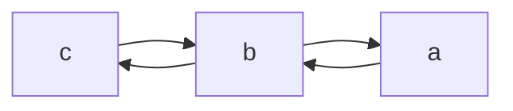
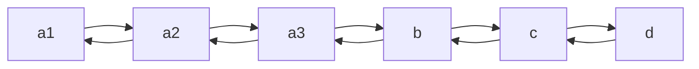
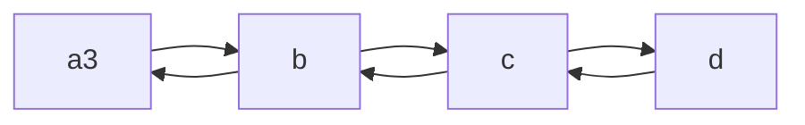
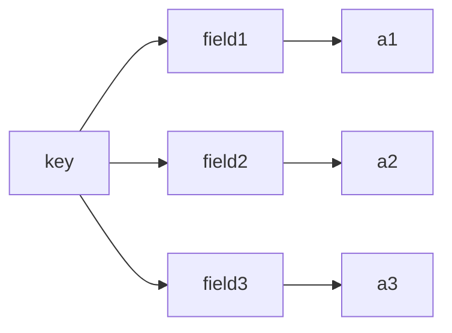
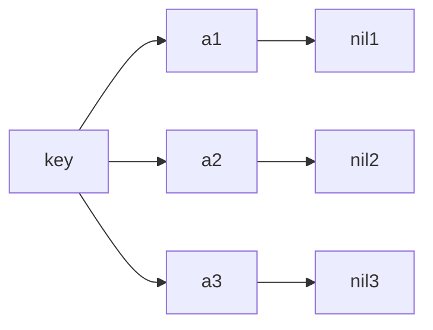
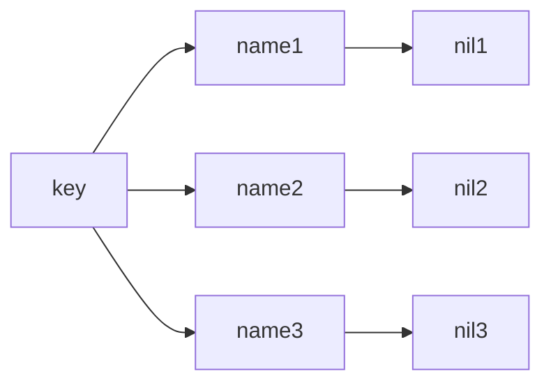
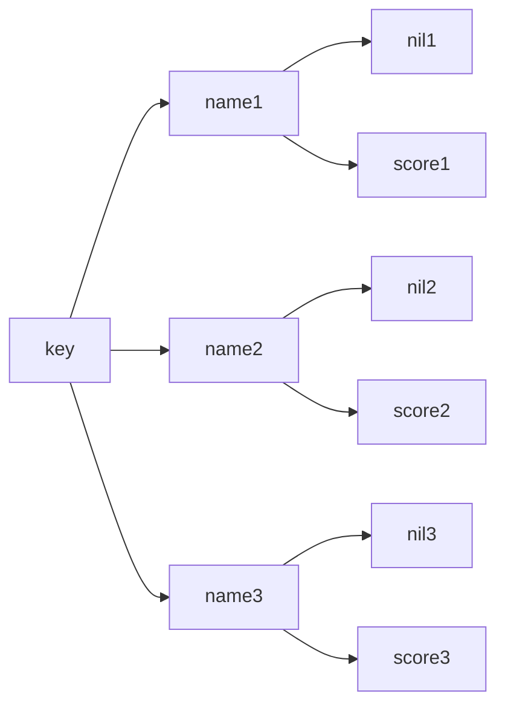
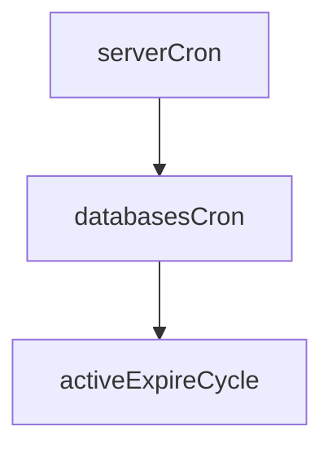
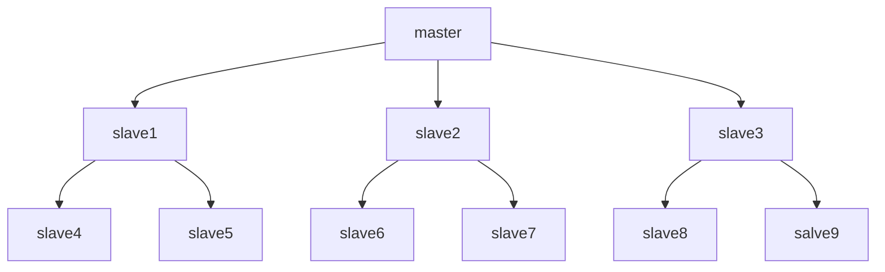

# redis基础

## 简介

### 概念

redis是一个用c语言开发的开源的高性能键值对数据库

### 特征

1. 数据间没有必然的关联关系
2. 内部采用单线程进行工作
3. 高性能
4. 多数据类型支持
   - 列表类型----list
   - 散列类型----hash
   - 集合类型---set
   - 有序集合类型----sorted_set
   - 字符串类型----String
5. 持久化支持，可支持数据灾难恢复

### 应用场景

- 为热点数据加速查询
- 任务队列（秒杀，抢购）
- 即时信息查询（排行榜，访问量）
- 时效性信息控制（验证码）
- 分布式数据共享
- 消息队列
- 分布式锁

### window安装

百度网盘

https://pan.baidu.com/s/1HP23tQJSFpN7DsiFJTMDOQ     提取码     yepo

下载之后，将其放到想要存放的地方，就可以解压缩了

解压缩之后，会看到两个exe文件，分别是

- redis-cli.exe
- redis-server.exe

其中redis-cli.exe是客户端，双击即可启动，redis-server.exe是服务端，双击即可启动

6379是默认端口号

## 基础操作

### 指令

- set  key 	value    	存放属性，如果已经存在，则覆盖
	 get key 			取出属性，若不存在key，取出来的则为空（nil）
	 clear			清除屏幕信息
	 help  命令名称	查看命令的帮助信息
	 quit				退出
	 exit				退出

## 数据类型

### 简介

redis中的数据都是key-value类型的。这里的数据类型指的都是value，所有的key都是字符串类型的。

### 5种常见数据类型

#### string

最简单的数据类型，也是最常见的数据类型

存储的数据：单个数据

数据格式：一个空间存放一个数据

存储内容：通常使用字符串，如果字符串以整数的形式表现，也可以当数字用

##### 基本操作

- set key value						存放数据，如果已经存在，则覆盖
	 get key							取出数据，若不存在key，取出来的则为空（nil）
	 del key							删除数据，若不存在属性，则提示0
	 mset key1 value1 key2 value2...	存放多个数据
	 mset key1 key2					取出多个数据
	 strlen key						取出ke必须y所对应的value的长度
	 append key value					在原有数据的基础上追加数据，如果不存在原有数据，就创建

##### 扩张操作

###### 针对于分表操作，保持主键的唯一性

- incr key								在原有的数据上+1，前提原有数据必须以整数方式显示
	 decr key								在原有的数据上-1，前提原有数据必须以整数方式显示		
	 incrby key increment					在原有的数据上加increment，前提原有数据必须以整数方式显示
	 decrby key increment					在原有的数据上减increment，前提原有数据必须以整数方式显示

  在上方两个指令中increment必须为整数，但不分正负

- incrbyfloat key increment				在原有的数据上加increment，increment可以是小数
	 decrbyfloat key increment				在原有的数据上减increment，increment可以是小数

  在上方两个指令中increment不分正负

当使用incr指令和decr指令时，数据会转成数值型进行操作

###### 针对于存活时间的操作

常见案例：一个账号在一天之内只能投一次票

- setex key seconds value				保存一个存在存活时间的数据

   键 		seconds       这个数据可以存活的时间，以秒为单位		value	值、

	 psetex	key	milliseconds  value		保存一个存在存货时间的的数据

  ​	milliseconds  这个数据可以存活的时间，以毫秒为单位		value	值

##### 注意事项

redis数据最大存储量512M

数值范围为   -9223372036854775807 到 +9223372036854775807 

##### 案例

###### 描述

存放一个微博大V的粉丝数量，博客数量

###### 表结构

表名 user

| 字段名 | 类型   | 默认                     | 键位 | 注释         |
| ------ | ------ | ------------------------ | ---- | ------------ |
| userid | number | 无默认值，自增，不可为空 | 主键 | 用户id       |
| fens   | number | 无默认值，不可为空       | 无   | 用户粉丝数量 |
| blogs  | number | 无默认值，不可为空       | 无   | 用户博客数量 |

###### 表数据

| userid | fens | blogs |
| ------ | ---- | ----- |
| 10000  | 60   | 10    |

###### redis存储

一、分别存储

```html
set user:userid:10000:fens 60
set user:userid:10000:blogs 10
```

二、json存储

```html
set user:userid:10000 {id:10000,fens:60,blogs:10}
```

这两种方式各有好处

###### 规范

当使用上面的方法进行存储信息时，对于key的命名是由规范的。一般来说，都是

key     表名:主键名:主键值:要存储的字段名

value   要存储的字段值

#### hash 

在上面的string中，我们介绍了两种存储表数据的方式

一、分别存储

二、json存储

但是这两种存储方式都有一定的缺点

第一种方式	改的话，比较简单，但拿的话，比较难。例如我正在看粉丝量，现在我要去看文章数量，这样的话，还需要重复去拿

第二种方式	取数据比较方便，但改的话，不方便

所以，出现了hash

##### 特点

一个存储空间对应多个键值对数据

注意，是一个存储空间对应多个数据，不是一个key对应多个value

hash结构描述	一个key对应多个value，每一个value有一个field（标识）

如果field较少，存储结构优化为类数组结构

如果field较多，存储结构使用HashMap结构

##### 基本操作

- hset key field value					存储数据，如果存在，则覆盖
	 hget key field 						取出数据，取出key中的一个field
	 hgetall	key							取出key所对应的数据
	 hdel  key  field 						删除数据，删除key中的一个field
	 hmset key field1 value1 field2 value2...	存放多个数据
	 hmget key field1 field2 				取出多个数据
	 hlen key							获取key中field的数量
	 hexists key field						判断key中是否存在field
	 hkeys key							查看当前key中所有的field
	 hvals key							获取当前key中所有的值
	 hincrby key field increment			设置指定字段的数值增加指定范围的值(不可以为小数)
	 hincrbyfloat key field increment		设置指定字段的数值增加指定范围的值(可以是小数）

##### 注意点

- hash类型下的value只能是字符串，不允许出现其他数据类型，不允许出现嵌套操作
- 每个hash最多可以储存2的32次方-1个键值对
- hash类型虽然可以存储大量的对象，但不要滥用
- hgetall操作可以拿到所有属性，但如果value过多，会造成效率低下

##### 第一个案例：购物车

###### 大致方案

- 将用户id作为key，为每位客户创建一个hash型的数据
- 将商品id作为field，购买数量作为value
- 添加商品，追加全新的field、value
- 浏览，遍历hash
- 更改数量，自增自减，更改value值
- 删除商品，删除field
- 清空，删除key

当用上面方法的时候，我们发现我们只是存储了商品id和商品数量，对于商品名称和商品图片等信息都没有存储。

所以：

有了下面这种方式

- 将用户id作为key，为每位客户创建一个hash型的数据
- 这个key中有两个field，第一个field以商品id：nums命名，存储数量；第二个field以商品id：info命名，存储信息,格式为json格式。

例子：假设用户id：0001，商品id1：001，商品数量：4，商品名称：曲奇饼干，商品图片：1.jpg

那么有如下操作

hash的key值为0001；

第一个field值为  001:num  ,值为   4

第二个field值为  001:info, 值为   {name:'曲奇饼干',portrait:'1.jpg'}

那么在这个设计中，我们又发现了一个问题，如果多个用户添加了同一件商品，那么在redis中就有很多商品信息的重复值。所以，我们又提出了下面一种思路

- 将商品的信息提取出来，作为一个单独的hash，专门存储商品信息

如下

现在，数据如下，有两个用户

| 用户id | 购物车中商品id | 商品信息         | 商品头像     | 商品数量 |
| ------ | -------------- | ---------------- | ------------ | -------- |
| 00001  | 0001，0003     | 曲奇饼干，U型枕  | 1.jpg，3.jpg | 4，3     |
| 00002  | 0001，0002     | 曲奇饼干，牛仔裤 | 1.jpg，2.jpg | 2，3     |

那么，hash设计如下，有3个hash

| key值             | field名             | field值                                                      |
| ----------------- | ------------------- | ------------------------------------------------------------ |
| goods（商品hash） | 0001，0002，0003    | {name:'曲奇饼干',portrait:'1.jpg'},{name:'牛仔裤',portrait:'2.jpg'},{name:'U型枕',portrait:'3.jpg'} |
| 00001（用户id）   | 0001:nums,0003:nums | 4,3                                                          |
| 00002（用户id）   | 0001:nums,0002:nums | 2,3                                                          |

然后呢，又发现问题，如果将所有的商品都存放到一个hash中，那么会导致hash存储的数据过多，影响效率，

所以，就要分hash，将商品类别相同的放到一个hash中去。

- hsetnx   key  field  value			设置key中field的值，如果其中已经有了值，那么不操作。如果其中没有值，那么再赋值

##### 第二个案例：抢购

###### 描述

电信公司出了30元、50元、100元的充值代金券各1000张。

###### 大致方案

- 以商家id作为key
- 商品id作为field
- 商品的数量作为value
- 抢购时，使用降值控制数量

#### list

一个存储空间存储多个数据，并对数据进入存储空间的顺序进行区分，底层通过双向链表结构实现

list是双向链表的结构

假设，现在有一个list，名字为list1，里面有，小米、华为、三星、苹果这四个数据，那么如下


##### 基本操作

- lpush   key value1 value2		从左边添加数据
	 rpush  key  value1 value2         	从右边添加数据
	 lrange  key  start  stop			选定范围显示，start是开始索引，stop是结束索引，在此命令中，如果start是0，stop是-1的话，那么效果是查出来所有的数据
	 lrange	key  index			根据索引获取数据
	 llen	key						获取key的数据的长度

在上述指令中

如果我执行        lpush	list1	  a  b   c    那么结构是如下图



##### 扩展操作

- lpop	key					获取并移除左边的第一个数据

	 rpop	key					获取并移除右边的第一个数据

	 blpop	key  timeout			规定时间内获取并移除左边的第一个数据

	 brpop	key	timeout			规定时间内获取并移除右边的第一个数据

    	在上面两个指令中，如果list中有数据，则会立马拿出并移除，如果list中无数据，则会等待指定时间，在指定时间内，若有了数据，立马拿出并移除，若一直没有数据，则指定时间结束，拿出数据为空。

     lrem key count value				移除指定数据

在使用上述指令中，count代表移除的个数，value代表移除的内容

假设，现在有一个list，其中有a1 、a2、a3、b、c、d,其中a1=a2=a3，只是索引不同，value值相同，假设值都为a



那么在使用了lrem  key  2   a  指令之后，就变成了



##### 注意事项

list中保存的数据都是string的，数据的总量是2的32次方减一

##### 案例

在微博、抖音、快手中，你关注的人的列表中，是按照时间顺序从先到后一次排序的。

这个可以根据list来做

#### set

##### 特点

存储大量的数据，且查询效率很高

在list中，存储大量的数据的目的达到了，但是因为list是双向链表结构，所以对于查询来说，并不是很优秀

set与hash十分相似，都是将一个key分成若干个field，不同的是，hash中field是标识，value是值。set中field是值，value是空，如下

有a1、a2、a3三个数据，分别用hash和set存储,如下

hash



set



所以说，set数据结构与hash完全相同，只不过set不存储值，只存储键，并且键不允许重复

##### 基本操作

- sadd	key	member						添加数据
	 smembers key							查询全部数据
	 srem	key	member						删除数据
	 scard	key								获取key中数据个数
	 sismember	key	value					判断key中是否有指定value

##### 业务场景1

在抖音、快手、虎牙、斗鱼这样的平台中，都会按照用户的爱好随机推送视频，但是为了控股用户的粘度，为给用户推送较少的其他方面的作品来让用户观看。

例如：用户在第一次登录虎牙直播时，让用户选择3个喜欢的分类，但是虎牙推送的直播并不完全是这3个分类里面的，还有一部分是来自于其他的分类，那么要实现这个功能，我们需要做到以下几步：

1. 将其他分类中的热门的直播挑选出来组成set集合
2. 从set集合中随机挑选若干信息
3. 这随机挑选的若干信息配合用户喜欢的3个分类的视频显示到页面

那么，我们需要以下的指令来帮助我们完成

- srandmember key count					随机从set集合中取出指定数量的数据
	 spop key								随机从set集合中取出指定数量的数据并将之删除

##### 业务场景2

在qq、微信中，有这样一种场景

qq添加好友时，会显示你和他有几个共同好友

微信关注公众号时，会显示有几个好友关注

那么，为了这种场景，我们需要了解以下的指令

###### 指令

- sinter  key1  key2						求出两个集合的交集，也就是求出两个集合的重叠数据
	 sunion	key1 key2					求出两个集合的并集，也就是求出两个集合所有的数据
	 sdiff  key1 key2						求出两个集合的差集，也就是key1中的数据去掉key1和key2中的重叠数据

现在有这样两个集合，第一个集合名叫   key1  ，  里面的数据有    q1，w1,e1三个数据

第二个集合名叫    key2 ，里面的数据有		q1，a1	2个数据

那么对于这两个集合使用以上的指令的结果为

sinter  key1 key2		------>			q1

sunion  key1 key2       ------->			q1,w1,e1,a1

sdiff key1 key2		------>			w1,e1

- sinterstore  destination  key1  key2			求出两个集合的交集，并将其放到指定的destination集合中
	 sunionstore  destination  key1  key2		求出两个集合的并集，并将其放到指定的destination集合中
	 sdiffstore  destination  key1  key2			求出两个集合的差集，并将其放到指定的destination集
	 smove  source  destination    member		将source集合中的member数据转移到destination集合中

##### 业务场景3

权限操作

当然，在实际的开发中，并不推荐用redis来实现权限操作，有成型的框架来帮我们完成，但是用redis也是可以完成的

###### 思路

我们可以在制造两个set，这两个set分别代表两个角色，两个角色里面的权限是不同的，在用户登录时，和这两个set集合进行上面的并集的操作，将其结果都放到用户中去

##### 其他业务

当然除了以上业务，还有很多其他业务场景，例如:网站黑白名单、网站访问量等

##### 注意事项

set中的数据是不可重复的

set的结构虽然与hash相同，但是不可以把set当hash用，也不能用

#### sorted_set（ZSet）

需求：数据排序

在上面的数据类型中，我们发现已经基本解决了问题，但当我们遇到了一些需要将数据按照一定的规则排序的时候，这些类型还不能满足，所以，有了sorted_set

从名字上来讲，我们可以知道sorted_set是在set的基础上扩展的，那么我们来看一下区别

set



sorted_set



如上图所示，sorted_set在set的基础上新增了一个字段，名叫score，这个score来存储数值，根据数值的大小来排序

##### 基本操作

- zadd key score1 member1						添加一个member1的数据，score为score1
	 zrange  key start  stop	（withscores）			按照score从小到大的顺序显示数据，start代表开始的索引，stop代表结束的索引，注意start和stop这两个数据和score没有关系,withscores这个数据可带可不带，不带的话，显示的就只有数据，带上的话，会连score的值一起显示
	 zrevrange key start stop (withscores)			和上一个指令几乎相同，只不过这个是按照score从大到小的顺序显示数据
	 zrem key member						删除数据
	 zrangebyscore key min max (withscores) (limit)	按照条件正向查询数据，min代表score的最小值，max代表score的最大值，limit表示分页

	 zrevrangebyscore key max min (withscores) (limit)	按照条件反向查询数据，min代表score的最小值，max代表score的最大值，limit表示分页
	 zremrangebyrank key start stop			按照索引删除数据
	 zremrangebyscore key min max			按照score值大小删除数据

如果要使用list的话，如下

1. zrangebyscore scores	0 3 limit 0 1 withscores
	. zcard key								获取集合数据总量
	. zcount key min max						查询在指定的score值的范围中，有多少数据
	. zinterstore destination numkeys key		把几个集合的交集转移到另一个集合中，numkeys表示集合的数量，numkeys是几，后面就要跟几个相关的集合，destination 表示新集合，这个新集合中只会出现原始的几个集合中的交集部分。另外，交集部分的score值会相加。
	. zunionstore destination numkeys key	 	与上方相同，这个是并集

###### 业务场景：排行榜

###### 涉及指令

1. zrank key member							按照从小到大的顺序，拿排名
	. zrevank key member							按照从大到小的顺序，拿排名
	. zscore key member							获得key中member数据的score值
	. zincrby key increment member					修改key中member数据的score值，increment是一个数据，代表member变化的操作。如果increment是1的话，那么member会加一，如果是-1的话，会减一

##### 注意事项

因为sorted_set是基于set的，那么sorted_set是不允许有重复的数据的。

##### 业务场景1


会员到期时间，经每个会员到期的时间记录为score值存入redis，然后按照顺序排列，每次处理时，只处理第一个的

###### 涉及指令

time   				查看当前系统时间

##### 业务场景2

处理权重，对于处理来说，有些请求的优先级是大于其他请求的，所以，我们可以用score来存储权重值，权重值大的优先处理

#### 5种数据类型综合案例

##### 案例1

现在，在许多应用种，为了吸引普通用户，出现了很多优惠福利。

假设场景：某软件的某个福利，普通用户一天可用10次，每天24点刷新。

对于这个场景，我们选用string类型，key代表用户的标识，value值则代表使用的次数

###### 具体思路

value记录使用次数，对此key设置时间限制，限制为1天，当value值小于10时，加一，如果value值达到10，则向用户返回错误。

我们发现对于上述思路来说，对于这个10的判断是比较繁琐的，所以，我们有了改良思路

key中的value值是有最大值的，为9223372036854775807 ，我们可以将value的初始值设为9223372036854775807-10,每次用户发起请求，就加一，当达到峰值是，软件自动报错。

##### 案例2

对于qq，微信这种通讯软件来说，我们可以设置消息置顶，那么当我们退出通讯软件后，先后有置顶信息，普通信息发送，那么消息应该怎么显示呢？

###### 具体思路

我们先用set类型记录置顶的用户。然后再创建两个list数据类型，分别用来存储置顶信息(list1)和普通信息(list2)

当有信息收到时，先去判断是否是置顶用户，然后将信息依次存储到list1或list2中。如果过了一段时间，有人重复发送信息，先将list中的上条信息删除，然后添加最新信息。

在显示的时候，优先显示list置顶，再显示普通信息。此处用list是利用了list具有顺序的概念

## 通用命令

### key通用命令

#### 基本操作

1. del key							删除key
	. exists key						是否存在key
	. type key							获取key的类型

#### 扩展操作

##### 时效指令

在上面，我们说value值有时效控制，在过了指定的时间之后，value值会变空，那么key也有时效控制

1. expire key seconds					给key设置时间，单位为秒，seconds为具体数值
	. pexpire key milliseconds				给key设置时间，单位为毫秒，milliseconds为具体数值
	. expireat key timestamp				给key设置时间，以时间戳的方式，timestamp	代表具体数值
	. pexpireat key milliseconds-timestamp	给key设置时间，单位为毫秒
	. ttl key								查询key剩余时间
	. pttl key								查询key剩余时间，本条指令和上条指令基本相同，如果key不存在，返回-2，如果key存在，但没有设置有效时间，返回-1，如果key设置了有效时间，返回有效时间
	. persist key							切换key的有效时间，将其转为永久性

##### 查询指令

keys pattern							显示指定格式的key，pattern代表格式，对于格式下面有具体表格介绍

| 符号 |        代表格式        |
| :--: | :--------------------: |
|  *   | 匹配任意数量的任意字符 |
|  ?   |    匹配任何一个字符    |
|  []  |    匹配一个指定符号    |

应用

|    指令     |                   操作                    |
| :---------: | :---------------------------------------: |
|   keys *    |               查看所有的key               |
|  keys it*   |          查看所有的以it开头的key          |
|  keys *it   |          查看所有的以it结尾的key          |
|   keys ?    |        查看所有key名为1个字符的key        |
|  keys it?   | 查看所有以it开头，后面有一个任意字符的key |
|   keys ??   |       查看所有任意两个字符命名的key       |
|  keys [a]   |             查看以a命名的key              |
|  keys [ab]  |            查看以a或b命名的key            |
| keys it[ab] |       查看以it开头，后面是a或b的key       |

##### 其他指令

1. rename key newkey					为key换名字
	. renamenx key newkey				为key换名字 

两个指令区别：假设现在有两个key，分别为key1，key2。它们的值分别为value1,value2.

当使用rename key1 key2指令时，key2会被key1覆盖掉，即key1改名成功，但原本的key2已经消失。现在key2的值为value1.

当使用renamenx key1 key2指令时，会失败，因为key2是存在的，所以操作失败

1. sort	 key (desc)(pattern) (limit)			为key排序，这个key只能是list、set、sorted_set属性的，这里只显示排序，不影响原操作,可以指定desc顺序，格式，分页
	. help @generio						查看指令

### 数据库通用命令

#### 问题

当我们在使用redis的时候，我们会随着redis存储数据的扩大，key的命名可能会发生一些意外。例如，当你创建一个新的key时，名字写成了已经存在的key值，那么会覆盖。

#### 解决方案

redis为我们提供了16个库，编码分别是0-15，这16个库之间的数据相互独立，默认使用0库

#### 基本指令

select index							切换数据库，index代表库编号

echo msg							打印

ping								测试服务器是否连通

quit									退出

move key db							转移key到指定库

flushdb								删除本库中的key

flushall								删除所有库中的key

dbsize								查看本库中的key数量

## jedis

### 简介

Jedis是Redis官方推荐的Java连接开发工具 。用来把程序与redis进行连接

### hello world

```java
 @Test
    public void testJedis(){
        //写入ip和端口号
        Jedis jedis=new Jedis("127.0.0.1",6379);
        //存入key
        jedis.set("key1","hello world");
        //取出并打印
        System.out.printf(jedis.get("key1"));
        //关闭连接
        jedis.close();
    }
```

### jedis操作其它类型

#### list属性

```java
 @Test
    //list属性
    public void testListJedis(){
        Jedis jedis=new Jedis("127.0.0.1",6379);
        jedis.lpush("key1","a","b","v");
        List<String> strs=jedis.lrange("key1",0,-1);
        for (String s :strs){
            System.out.println(s);
        }
        jedis.close();
    }
```

hash属性

```java
 @Test
    public void testSetJedis(){
        Jedis jedis=new Jedis("127.0.0.1",6379);
        jedis.hset("hash1","a1","a1");
        jedis.hset("hash1","a2","a2");
        jedis.hset("hash1","a3","a3");
        Map<String, String> map = jedis.hgetAll("hash1");
        System.out.println(map);
        jedis.close();
    }
```

其他类型与此类似

### 案例

在讲解redis的时候，我们用了一个24小时之内只有10次机会的一个案例，那么现在我们用java代码来实现它

```java
import redis.clients.jedis.Jedis;
import redis.clients.jedis.exceptions.JedisDataException;

public class Service {
    private String id;
    public Service(String id){
        this.id=id;
    }
    public void service(){
        Jedis jedis=new Jedis("127.0.0.1",6379);
        String value=jedis.get("user::"+this.id);
        if(value==null){
            //不存在，创建
            jedis.setex("user::"+this.id,20,Long.MAX_VALUE-10+"");
            //调用一次业务操作，值加一
            Long count=jedis.incr("user::"+this.id);
            business(this.id,count);
        }else{
            //存在。自增
            try {
                //因为存在溢出的问题，所以放在异常里面
                Long count=jedis.incr("user::"+this.id);
                business(this.id,count);
            }catch (JedisDataException jedisDataException){
                System.out.println("使用次数已达上限");
            }
        }
        jedis.close();
    }
    //业务方法
    public void business(String id,Long count){
        System.out.println("用户id");
        System.out.println(id);
        System.out.println("业务剩余次数");
        System.out.println(Long.MAX_VALUE-count);
    }
}

class myThread extends Thread{
    Service sc;
    public myThread(String id){
        sc=new Service(id);
    }
    @Override
    public void run() {
       while (true){
           sc.service();
           try {
               Thread.sleep(300);
           }catch (InterruptedException e){
                e.printStackTrace();
           }
       }
    }
}
class test{
    public static void main(String[] args) {
        myThread myThread1=new myThread("001");
        myThread myThread2=new myThread("002");
        myThread1.start();
        myThread2.start();
    }
}

```

在上述方案中，我们采用多线程方式，是因为有多个用户，当然，在上面代码中，还有一些瑕疵，例如，线程的睡眠时间，key的有效时间等等，这些可以采用配置文件的方式进行配置

### jedis工具类

在实际应用中，我们应该是从一个工具类中设置连接池，当需要jedis时，连接

所以，如下

先设置配置文件，配置文件为redis.properties

```properties
redis.port=6379
redis.host=127.0.0.1
redis.maxTotal=30
redis.maxIdle=10
```

然后写jedis工具类

```java
import redis.clients.jedis.Jedis;
import redis.clients.jedis.JedisPool;
import redis.clients.jedis.JedisPoolConfig;

import java.util.ResourceBundle;

public class UtilJedis {
    //连接池
    private static JedisPool jp=null;
    static {
        //获取配置文件
        ResourceBundle rb=ResourceBundle.getBundle("redis");
        //获取属性
        //ip
        String host=rb.getString("redis.host");
        //端口
        int port=Integer.parseInt(rb.getString("redis.port"));
        //最大连接数量
        int maxTotal=Integer.parseInt(rb.getString("redis.maxTotal"));
        //最大活跃数量
        int maxIdle=Integer.parseInt(rb.getString("redis.maxIdle"));
        //连接池配置
        JedisPoolConfig jpc=new JedisPoolConfig();
        //配置
        jpc.setMaxIdle(maxIdle);
        jpc.setMaxTotal(maxTotal);
        //将配置加到连接池中
        jp=new JedisPool(jpc,host,port);
    }
    //获取连接方法
    public static Jedis getJedis(){
        //返回一个jedis
        return jp.getResource();
    }
}

```

pom.xml

```xml
 <dependencies>
        <dependency>
            <groupId>redis.clients</groupId>
            <artifactId>jedis</artifactId>
            <version>3.2.0</version>
        </dependency>
        <dependency>
            <groupId>junit</groupId>
            <artifactId>junit</artifactId>
            <version>4.12</version>
        </dependency>
        <dependency>
            <groupId>org.slf4j</groupId>
            <artifactId>slf4j-simple</artifactId>
            <version>1.7.25</version>
            <scope>compile</scope>
        </dependency>
    </dependencies>
```

### redis可视化工具

redis作为当前一个热门的工具，所以有很多工具可以帮助我们使用

我将其上传到百度网盘中

网址https://pan.baidu.com/s/1rsZjaF-IvXl60i-Z5XhXxA

提取码	j9ru

下载之后，直接傻瓜式安装即可

# redis高级

此内容需要在linux服务器上操作，大家可以操作虚拟机，或者购买服务器进行操作

## redis持久化

### 简介

利用永久性存储介质将数据进行保存，在特定的时间将保存的数据进行恢复的工作机制称为永久化

#### 持久化的原因

防止数据丢失，确保数据安全性

#### 方式

持久化的方式分为两种

①快照

每隔一段时间，将文件进行保存，记录。

②过程

将对文件的操作记录下来。

以上这两种方式在redis里面分别称为RDB和AOF

### RDB

#### 实现方式

##### 第一种方式

save指令					执行save命名，就会在指定目录中生成一个后缀为rdb的文件

###### 配置文件相关设置

dir					设置.rdb文件保存的目录

dbfilename			设置保存的文件的名字

rdbcompression		设置保存数据的时候是否压缩

rdbchecknum		设置是否进行RDB文件格式校验

###### 恢复

将数据保存下来之后，是在启动的时候进行恢复数据

那么在使用这种方式保存数据的时候，因为redis是单进程，所以，在线上环境中，如果依次执行多个指令，包括save指令，那么在执行到save指令时，后面的指令必须等待save指令执行完毕时，才能继续执行。这样容易导致阻塞。

##### 第二种方式

bgsave					手动启动后台保存操作，不立即执行

###### 原理

这种方式保存，是后台保存数据。当执行此命令后，服务器会去调用fork函数，生成一个子进程，让子进程在服务器空闲的时候去保存数据。

使用这种方式可以很好的防止第一种方式所造成的阻塞的问题

##### 第三种方式

save second changes					redis自动执行保存操作

在上两种命令中，都需要手动去操作，那么这个指令可以去告诉redis服务器，让redis服务器去自动的进行执行保存，其中second是时间，changes是key的数量。

例如：save  60   10

就是在60s内有10个key发生了变化，就把所有数据进行保存。如果60s内没有10个key发生变化，那么就重新计时。当满足条件时，会去调用bgsave来保存数据

###### 配置

此命令实在conf文件中进行配置。而不是命令行形式

###### 判断标准

那么是如何判断key发生变化了呢

第一：例如get指令这种没有对数据产生影响的就不算发生变化

第二：必须对数据发生变化的操作

第三：redis不会去比较原数据和现有数据

例如：set key1 name1这是一个指令，算影响数量+1；

如果接下来执行 set key1 name2指令，影响数量+1;

也就是说，不管是不是同一个key发生变化，只要是两次变化，就算影响数量+2；

##### 方式对比

因为在save配置中，执行的还是bgsave指令，所以不对第三种方式进行比较

|         方式         | save指令 | bgsave指令 |
| :------------------: | :------: | :--------: |
|         读写         |   同步   |    异步    |
|       是否阻塞       |    是    |     否     |
|    是否发生新进程    |    否    |     是     |
| 是否产生额外内存消耗 |    否    |     是     |

##### 其他特殊启动方式

全量复制

服务器运行过程种重启

debug  reload

关闭服务器指定保存数据

shutdown save

#### RDB优点

存储效率极高

RDB存储的是redis在某个时间点的快照

RDB的恢复数据的速度比AOF快

#### RDB缺点

无法做到实时持久化

bgsave指令会牺牲一些性能

RDB可能会出现各版本服务器不兼容问题

基于快照思想，每次都是将全部数据保存，当数据过大时，效率很低

宕机可能会丢失数据

### AOF

#### 简介

以日志的方式记录数据

AOF是redis的主流记录方式

#### 三种策略

##### always

每次操作都写入AOF文件中。零误差，但性能低

##### everysec

每秒钟保存一次，准确性较高，性能较高。

在突然宕机的情况下，会损失一秒的数据

##### no

系统控制

#### 配置

使用aop需要定义一些配置文件中的配置

appendonly   yes\no			默认为no，不开启，需要改为yes，开启aop

appendfsync		always\everysec\no		开启策略

appendfilename filename		配置文件的名字，后缀为aof，建议配置为appendonly-端口号.aof

dir							配置保存路径

#### 重写

##### 简介

在使用AOF的时候，如果遇到下面这种情况

```java
set name aa
set name bb
set name cc
```

我们会发现，在aop文件中，会记录3条数据，但是我们知道，上面这三条命令中，其实我们只需要知道最后一个指令就可以了。再例如下面这种情况

```java
incr num
incr num
incr num	
```

在上面这种情况中，aop文件也是分为3条数据记录的，那么我们可以把上面的三条数据改为set num 3

以上说的功能就称之为AOF重写

简而言之，AOF重写就是把文件中的无效指令或者可以合并的指令删除或者重合

##### 重写的作用

1. 降低文件大小，降低磁盘占有率
2. 提升恢复速度
3. 提高持久化效率

##### 方式

###### 手动重写

bgrewriteaof指令

这个指令与bgsave类似，都是在后台调用fork函数，启用一个新进程，在系统空闲时去操作文件。然后返回信息。返回的信息存在日志里面

###### 自动重写

服务器在开启了AOF功能之后，会维持2个变量，分别是：

aof_current_size			aof文件当前大小

aof_base_size			aof文件基本大小

这两个变量可以通过info来查看大小

然后设定条件

```
auto-aof-rewrite-min-size size 
auto-aof-rewrite-percentage percent
```

第一条指令为设置文件的大小

第二条指令为设置变化的百分比

以下是判断条件

```
aof_current_size>auto-aof-rewrite-min-size
aof_current_size-aof_base_size/aof_base_size=auto-aof-rewrite-percentage
```

### RDB与AOF区别

|  持久化方式  |    RDB     |     AOF      |
| :----------: | :--------: | :----------: |
| 占用存储空间 |     小     |      大      |
|   存储速度   |     慢     |      快      |
|   恢复速度   |     快     |      慢      |
|  数据安全性  | 会丢失数据 | 依靠策略决定 |
|   资源消耗   |     大     |      小      |
|  启动优先级  |     低     |      高      |

以上的描述都是相对而言的。

#### 应用场景

如果对数据很敏感，不想让数据丢失的话，使用AOF

如果能承受分钟内的数据丢失，且追求过高的恢复速度，使用RDB。

灾难恢复用RDB。

建议同时开启RDB和AOF

### 持久化应用场景

- Tips1:redis应用于抢购,限购类、限量发放优惠券、激活码等业务的数据结构存储设计
- Tips2:redis应用于具有操作先后顺序的数据控制
- Tips3:redis应用于最新消息展示
- Tips4:redis应用于基于黑名单与白名单设定的服务控制
- Tips5:redis应用于计数器组合排序功能对应的排名
- Tips6:redis应用于按次结算的服务控制 

## 事务

### 情景

生活中有这样一种情况，如果我正在干一件事情，例如，今天我想数一下家里的零钱有多少，那么在我数的时候，旁边有人在背九九乘法表，那么这就会影响到我，甚至会影响到我最后的数出的零钱的多少。

### 简介

Redis 事务的本质是一组命令的集合。事务支持一次执行多个命令，一个事务中所有命令都会被序列化。在事务执行过程，会按照顺序串行化执行队列中的命令，其他客户端提交的命令请求不会插入到事务执行命令序列中。 

总结说：redis事务就是一次性、顺序性、排他性的执行一个队列中的一系列命令。　　 

### 基础操作

```java
multi				作为事务的开启位置
exec				作为事务的结束位置
这两个指令成对出现。
当执行multi指令后，之后的命令都不会立即执行，而是加入到一个队列中去，当遇到exec指令时，再去执行队列中
的指令，返回的是每条指令对应的结果
discard				取消事务
当执行了multi指令之后，如果操作失误的话，可以输入discard指令，那么事务将取消
```

### 注意事项

如果在开启事务之后，我们输入了错误的指令会是什么后果呢？

错误指令分为两种

一、语法错误

例如：单词拼写错误，当遇到这种情况时，事务将会取消

二、逻辑错误

例如：将string类型当成list类型使用，那么事务将会划分执行，指令对的依然会执行，错的就报错

```java
set name gg
get name
set name rr
get name
lpush name a b
get name
```

如上，就有六条指令，假设这6条指令都在一个事务中，那么第5条指令会执行错误，但是前4条和第6条会执行正确

### 锁

在生活中，我们会遇到这样一种情况，假设到了发工资的时候，那么有这个权限的人有3个，那么在实际生活中，会不会这3个人重复的发工资呢？例如：A发完工资，B发工资，然后C发工资。很显然，这是不可能的。

```java
watch	key					监视key
unwatch						取消对所有key的监视
```

当执行watch命令后，如果监视的key的值发生变化，那么事务就将取消。

注意，不管这个事务里面有没有影响被监视的key，都会被取消。当然，不是立即通知取消。而是在输入exec指令后，取消事务。

例如

```java
set name kk				创建了一个name，值为kk
watch name				监视name
multi					开启事务
set key1 gg				
get key1				
假设在这时，有另一个客户端对name进行了操作。
exec					结束事务
报空
```

#### 分布式锁

setnx  lock_key value 			设置锁

这个lock_key必须是不存在的，不然不成功。其他的客户端想要操作这个key的话，必须等我这个客户端将锁解开才可以，直接del删除就可以解锁

那么上面这种是有问题的，当我把一个key锁起来之后，忽然我的电脑短路了，或者宕机了。那么其他人就不能操作这个key了。所以，我们应该加上时间限制，当达到时间后，会自动解锁

expire lock_key second

pexpire	lock_key milliseconds

## 删除策略

### 过期数据

在前面的时候，我们说过可以给key设置时间，当时间到了，会过期，那么，这些过期的数据有没有被删除呢

#### 策略

##### 定时删除

设置一个定时器，当key设置了时间限制，并且时间到达之后，立即删除

优点：节约内存

缺点：cpu压力较大

用性能换存储空间

##### 惰性删除

当数据过期后，不去管，当过期后第一次调用该数据时，删除

优点：节约cpu性能

缺点：内存压力很大

用存储空间换性能

##### 定时删除

以上两种情况很极端，那么这一种方式就是比较折中的

当redis服务器启动后，有一个server.hz的值，默认为10

服务器每秒钟执行server.hz次serverCron方法，如下图，再依次调用，activeExpireCycle依次对每个库进行检查

activeExpireCycle每次执行的时间为250/server.hz毫秒

当检查库时，随机从库中抽取W个key检测

如果key超时，删除key

如果删除的key的数量大于W的四分之一，那么再次抽取W个key检测，循环此过程，反之，则继续下个库

如果在检查过程中activeExpireCycle执行时间到了，服务器中有一个current_db专门记录检查的进度，存储检查到的库的编号，如果执行时间到了，那么下次执行时，就根据current_db来开始执行



redis内部使用的是惰性删除和定期删除

### 逐出策略

那么当我添加新数据时，这时redis库中内存已满，并且存储的都是永久性数据。那么这时就需要逐出

redis在执行每一个命令前，都会调用freeMemoryIfNeeded来检测内存是否充足，如果内存不满足，那么redis就会删除一些数据来清理存储空间。清理数据的策略称为逐出算法，当然逐出算法并不一定成功，当执行一次之后，如果没有删除数据，那么会反复执行，当执行次数到达界限时，逐出失败

#### 指令

```java
maxmemory				最大可使用内存
maxmemory-samples		每次选取删除的个数
maxmemory-policy		删除策略
```

#### 配置

检测易失数据，这个数据指的是有期限的数据

1. volatile-lru					挑选最近最少使用的数据淘汰
	. volatile-lfu					挑选最近使用次数最少的数据淘汰
	. volatile-ttl					挑选将要过期的数据淘汰
	. volatile-random				任意选择数据淘汰

检测全部数据

1. allkeys-lru						挑选最近最少使用的数据淘汰
	. allkeys-lfu						挑选最近使用次数最少的数据淘汰
	. allkeys-random					任意选择数据淘汰

放弃逐出策略

no-enviction							不淘汰

以上配置都在conf文件中进行配置

例如：

```java
maxmemory-policy volatile-lru				
```

## conf配置文件

### 常用配置

```java
daemonize yes\no			 				   设置服务器是否以守护进程的方式运行
bind ip										  绑定主机地址
port 端口号				 				    绑定端口号
databases 数值			  					 设置库数量
loglevel debug|verbose|notice|warning			设置服务器以指定日志记录级别，默认verbose
logfile 端口号.log								日志记录文件名
maxclients 数值								 最大客户端连接数
timeout	数值									客户端最大闲置时间，超过时间，断开连接
include	路径.conf								导入并加载指定配置文件信息
```

上面的第9条配置的具体应用场景为，在开发时，需要多个配置文件，但这些配置文件有相同处，我们可以将相同处提取出来，写成一个单独的conf文件，然后根据这条命令来引入

## 高级数据类型

### Bitmaps

假设，0代表男生，1代表女生

如下

| 性别 |
| :--: |
|  0   |
|  0   |
|  0   |
|  0   |
|  1   |
|  1   |
|  1   |
|  1   |

我们可以看出在这一列中有两个男生，两个女生，那么我们可以这样来表示00001111。前4位是男生，后4位是女生，这种数据就称为Bitmaps.

#### 操作

```java
setbit key offset value					设置key中的指定位置的值，value只能是0或1
getbit key offset						获取key中的指定位置的值
bitcount key start end					统计key中1的数量
bitop and/or/not/xor destkey key1 key2   对多个key进行操作，生成一个新的key
```

and 交  or并   not 非 xor异或

合并操作，例如：值为001  和   值为  101的两个值合并的话，生成一个新的值 为   101。

规则：0+1=0；1+1=1；0+0=0；第一位和第一位相加，第N位和第N位相加

#### 应用场景

假设，一家电影公司由于内存问题，需要下架一些电影。那么，下架的电影肯定是不经常被看的。

假设，这家电影公司一共有100个电影。那么bitmaps一共有100位。

记录今天的，如果编号为1的电影被观看，则记为1；反之，记为0。

每天记录一共bitmaps，最后，可通过合并操作，查出有多少电影没有被观看

### HyperLogLog

去重复数据，求基数。

#### 指令

```java
pfadd key element 						添加数据
pfcount	key								统计数据
pfmerge destkey sourcekey				合并数据
```

例如下面的指令

```java
pfadd name1 001			给name1添加一个001
pfadd name1 001			给name1添加一个001
pfadd name1 001			给name1添加一个001
pfadd name1 001			给name1添加一个001
pfadd name1 002			给name1添加一个002
pfadd name1 002			给name1添加一个002
上面这6个指令呢，一共给name1添加了4个001，2个002。那么当我们执行下面这个命令的时候
pfcount name1
查询的结果是2
```

#### 注意事项

当数据到了足够大的地步，这个数据类型是有误差的，范围是0.81%

这个数据类型的最大占用空间是12K.随着数据的添加，空间不断增加。但最大就是12K

当任意两个hyperloglog合并之后，生成一个新的，不管之前的两个的空间多少，这个新的空间一定是12K

### GEO

#### 简介

根据坐标算距离。在饿了么，美团、微信、qq这一类软件中，我们都可以看到我们和店家，我们和附近的人的距离。那么这GEO就可以完成这一点

#### 指令

longitude	经度

latitude		纬度

##### 基本指令

```java
geoadd	key	longitude latitude member			添加坐标，member代表坐标的名称
geopos key member								获取坐标
geodist	key member1 member2						计算距离
```

如下

```java
geoadd geos 1 1 geo1
geoadd geos 2 2 geo2
如上，就添加了2个坐标。
geodist geos geo1 geo2 （unit）	这样就求出了距离，unit是距离的单位，默认是米，也可以指定为km
```

##### 扩展指令

```java
georadius key longitude latitude radius (单位)			根据坐标范围去查，radius代表距离，查出来显示的是member
georadiusbymember key member radius	（单位）			根据点去查，radius代表距离，查出来显示的是member
上面两个指令后面还有若干参数
例如
withhash			在显示member的基础上，显示坐标对应的hash值
withcoord			在显示member的基础上，显示坐标
withdist			在显示member的基础上，显示距离
升序降序操作
--------------------
geohash key member					求坐标的hash值
```

# redis集群

## 主从复制

### 简介

有时候，一台服务器已经不能满足需求，这时，可以使用多台服务器来进行服务。在使用多台服务器的过程中，需要解决数据共享的问题。所以，有了主从复制

主从复制：将一个服务器的数据复制到其他服务器中。前者称为master，后者称为slave。

### 特点

主从复制的过程是单向的，只能从master到slave。

一个slave只能对应一个master，一个master可以对应多个slave，但是一个slave可以对应多个slave

如下



### 作用

读写分离，master负责读，slave负责写

负载均衡

故障恢复，当master故障时，可以推选出一个slave当选master。

### 流程

#### 大致流程

①连接，slave连接master

②同步，将master数据复制到slave中

③反复同步，将master后面接收的数据复制到slave

#### 第一步详解

第一步slave连接master：

1. slave端发送命令 slaveof IP port
2. master接收到命令，响应
3. slave端保存master端的端口和ip
4. 根据保存的信息建立socket
5. slave端定时发送ping，master回应pong
6. 有时还需要权限验证
7. slave端发送指令replconf listening-port
8. master接收指令，保存slave端端口号

发送slaveof的方式

1. 可以在连接服务器之后，发送命令
2. 可以在启动服务器时，后面加上命令
3. 可以在配置文件中，加上命令（主流）

##### 第一步所需命令

slaveof no one       						 slave端发出，断开连接

requirepass	password					master配置文件添加，密码验证

config set requirepass	 password			master启动之后，添加密码

config get requirepass					拿密码

auth password							slave发密码

masterauth password						slave端配置文件中纪录master密码

redis-cli -a password						启用服务器时，输入密码

#### 第二步详解

1. slave端请求同步数据，发送psync2指令
2. 创建RDB文件
   1. master接收到命令，执行bgsave
   2. 第一个slave连接时，创建命令缓冲区
   3. master端生成RDB文件，通过socket传递过去
3. slave端恢复数据，收到RDB文件，情况原有数据，执行恢复过程
4. 恢复部分数据（指连接之后master创建的数据）
   1. slave发送请求命令
   2. master将命令缓冲区的命令发送给slave端（aof方式）
   3. slave端接收到aof文件之后，先重写，再恢复

##### 注意事项

###### master端

如果master端数据很大，那么尽量在master比较空闲的时候进行数据同步

设置的命令缓冲区尽量不要太小，如果很小的话，那么会导致前面的指令消失。默认是1MB

repl-backlog-size    缓冲区大小

###### slave端

在数据同步时，尽量不要进行数据的使用，不要对外服务

设置是否对外服务			slave-serve-stale-data   yes|no

在slave端过多时，尽量错峰操作

如果slave端很多，建议树状结构，使一部分slave端从某个slave端获取数据，但是这样的话，会导致数据一致性变差，延迟大

#### 第三步详解

##### 运行id

每个服务器在运行的时候都会有一个运行id，用来识别身份，这个id是不固定的，一个服务器多次启动的运行id也是不一样的。

运行id有40位

在master与slave首次连接的时候，master会把运行id发送给slave，slave会保存此id，可以通过info查看id

##### 缓冲区和偏移量

缓冲区是由偏移值和字节值组成。

假设一个master连接了3个slave，这时，其中一个slave停电了。等到来电的时候，我们怎么知道这个slave差哪些数据呢？就是靠偏移值

假设现在有这么一个命令

```java
set key1 hh
```

那么，aof文件会记录为

```java
$3
set
$4
key1
$2
hh
```

但在缓冲区中应变为

```java
$3\r\n
set\r\n
$4\r\n
key1\r\n
$2\r\n
hh\r\n
```

那么上述命令在缓冲区的实际格式是

| 偏移值 | 2211 | 2212 | 2213 | 2214 | 2215 | 2216 | 2217 | 2218 | 2219 | 2220 | 2221 |
| ------ | :--: | :--: | :--: | :--: | :--: | :--: | :--: | :--: | :--: | :--: | :--: |
| 字节值 | ...  |  $   |  3   |  \r  |  \n  |  s   |  e   |  t   |  \r  |  \n  |  $   |

是这样的格式，一个偏移值对应一个字节值，那么在slave断开的时候，slave会记录当前的偏移值，master会记录已发送信息的slave的偏移值，使这两个偏移值相互比较。然后再同步数据

那么在这时候，我们想起来第二步的时候，我们slave首次连接master，是不知道运行id和偏移量的。所以，下面对第二步再进一步解释

slave端发送psync ? -1 命令，这个命令的意思为，全部复制

master收到命令，执行bgsave命令生成RDB文件，同时记录当前偏移量offset

master发送+FULLRESYNC runid offset，通过socket发送RDB文件到slave

slave端接收到之后，记录master的runid和offset，清空现在库中的所有数据，然后根据RDB文件恢复数据

以上的过程称为全量复制

slave端发送命令psync runid offset 到master端

master接收到命令之后，判断runid是否正确，不正确的话，则进行全量复制。然后判断offset的值是否在缓冲区中，如果不在的话，则进行全量复制，如果在的话，则去比较大小。如果offset与缓冲区最大的偏移值一样，则忽略此命令，如果不一样，master端发送+CONTINUE offset(这个offset是现在缓冲区中的最大偏移值)，通过socket发送offset(slave端发送的offset值)到offset(缓冲区的offset值)的数据。

slave端接收到之后，先将offset保存，然后将接收到的AOF文件重写，然后恢复数据

##### 心跳机制

在第三步中，我们需要双方反复的发送指令，那么就称为心跳机制

###### master心跳

指令：ping

作用：判断slave是否在线

时间：默认10秒钟一次

###### slave心跳

指令：REPLCONF	ACK （offset）

时间：默认一秒一次

作用：确认master是否在线；如果offset不一样的话，则复制部分数据。

在心跳机制中，是相互的。如果master超过1秒钟没有接收到slave端的REPLCONF ACK指令，那么master端则知道slave端掉线。同样的，如果slave端超过10秒钟没有接收到master的ping命令，那么slave端就知道master端掉线。

###### 相关属性

min-slaves-to-write   2				最小的slave的连接数量

min-slaves-max-lag   8			最大延迟

假如上面这样设置，那么如果slave数量小于2个，或者延迟大于10秒，则master端停止写能力，停止数据同步

### 常见问题

#### 频繁的全量复制

①   当master的作用越来越大，一旦master重启，那么所有的slave端都要进行全量复制

优化方案：

master创建master_replid变量，和runid类似，长度41位，并发送给所有的slave。

在master关闭时，执行shutdown save命令，进行RDB持久化，将runid和offset保存到RDB文件中。

可以通过redis-check-rdb rdb文件路径来查看信息

master重启后，将根据RDB文件恢复数据，保存上次的runid和offset，使全量复制不用再发生。

②	缓冲区是一个可进可出的队列，那么如果缓冲区过小的话，会导致slave端发送的offset在缓冲区中找不到，从而发生频繁的全量复制。

方案：设置缓冲区大小

建议设置成   2 * 重连平均时长 *  每秒钟产生的数据总量

#### 频繁的网络中断

如果在连接中，master传过来的命令涉及到的数据比较多的话，就会大量占用slave的cpu性能，就会影响slave响应master

而slave如果一直没有响应master的话，从而就会影响master的资源

所以，可以设置一个超时时间，如果slave超过这个时间还没有响应的话，master就释放slave

repl-timeout   设置超时时间   默认60秒

这个超时时间的设置至少是ping频度的5-10倍

## 哨兵模式

### 简介

哨兵是一个分布式系统，用于对主从结构中的每台服务器进行监控，当出现故障时，通过投票机制选择新的master，并将所有的slave连接到新的master

##### 启动指令

./redis-sentinel  sentinel配置文件路径.conf

### 流程

哨兵模式大概可以分为3个流程  监控、通知、故障转移

#### 监控流程

有两个哨兵sentiel1 和sentiel2

sentiel1去连接master，然后发送info指令，获得master的信息，和所有的slave的信息。然后这个master里面会存储有sentiel1的信息。这时，sentiel1和master会建立一个cmd连接，以方便命令传输

sentiel1然后根据获取的slave的信息去连接每一个slave，发送info指令，获取slave的信息。

这时，sentiel2进来了，它也要重复上面的步骤，那么在sentiel2连接master之后，会发现master被其他的sentiel连接过，所以两个sentiel也会产生连接，使两个sentiel之间的数据保持一致。

所以，不管有多少个sentiel，每两个sentiel之间是互通的。

在这里互通的网中，每个sentiel一旦获取到和自己本身不一致的数据，就会快速的更新。

#### 通知流程

一个sentiel给所有的master和slave发送指令，当sentiel接收到所有的回复指令之后，会通知给其他的sentiel。

#### 故障转移流程

当sentiel发送给master指令，没有收到回复时，会标记master为sdown状态，然后通知给其他的sentiel。其他的sentiel接到通知后，会去验证master是否正常工作，如果有一定数量(在sentiel.conf文件中配置数量)的sentiel认为master不能正常工作。那么master就会变成odown状态。

然后sentiel之间通过投票选出一个去处理这件事情的sentiel。假设选出了sentiel1。

那么sentiel1要从slave之间选出新的master，是有以下规则的

1. 先去掉不在线的slave
2. 然后去掉响应慢的slave
3. 然后去掉与原master断开时间久的
4. 到这一步就根据优先级，选用优先级高的
5. 如果优先级相同，那么根据offset判断，选用offset大的
6. 如果offset再相同，就根据runid判断，选择runid中最小的（runid不可能存在相同的情况）runid不是字符串，是一个十六进制的40位值

然后选出新的master之后，然后sentiel1向新的master发送slaveof no one指令

向其他的slave发送 slaveof 新master信息，使之连接新的master

## 集群

### 简介

随着业务量的增加，一个服务器已经无法满足需求，所以出现了集群，集群就是将多个服务器用网络连接起来，使用统一的管理方式，对外呈现出单机的效果

### 作用

降低单台服务器的访问压力，实现负载均衡

降低单台服务器的内存压力，实现可扩张性

降低单台服务器宕机的影响

### radis集群结构设计

那么有了多台服务器，如何确定一个key到底是存在哪个服务器就是我们的一个问题

将所有的存储空间等划分为16384个存储空间，每台服务器保存一部分，我们通过key的名称进行一定的算法，得出一个值，根据这个值，就把key放到对应的存储空间中。

如果现在已经有两个服务器，我再加一台，那么这16384个存储空间又怎么划分呢。

会将原先两个服务器的存储空间拿出一部分，放到新的里面，这个存储空间，称为槽。

所有的服务器之间会进行互联，每个服务器都知道自己所存储的槽的范围，也知道其他服务器所存储的槽的范围。

假设，这时有一个请求发起，请求key，先去请求服务器A，如果这个key对应的槽在服务器A中，那么直接返回结果，如果不在的话，在根据服务器A中所记录的数据，获得这个槽所对应的服务器，然后去访问对应服务器。

# 常见问题

## 缓存预热

在启动服务器的时候，会忽然宕机。这是因为数据太大。这时就需要缓存预热

统计出那些访问频率比较高的信息，然后设置优先级，在加载的时候，会优先加载级别高的数据

简而言之，缓存预热就是系统启动前，提前将相关的缓存数据直接加载到缓存系统。避免在用户请求的过程中，先查询数据库，然后再将数据缓存的问题。用户直接查询事先被预热的数据

## 缓存雪崩

### 概述

1. 在redis中，一个集中的时间期内，大量的key过期。
2. 那么在这时，请求很多访问过期的数据，redis无法处理，向数据库获取数据。
3. 数据库一时难以解决过多的请求，无法及时处理
4. redis服务器大量请求被积压，出现超时现象。
5. 数据库流量暴增，数据库崩溃
6. 数据库重启后无用，还是面对缓存中没有数据的情况
7. redis服务器资源被严重占用，redis服务器崩溃
8. redis集群崩溃
9. 应用服务器崩溃

我们可以发现，这个问题的根本就是

在短时间内大量的key过期

### 避免雪崩方案

更多的页面静态化处理

构建多级缓存机构（例如：nginx缓存+redis缓存）

限流，降级（牺牲一部分客户体验，来降低服务器压力）

灾难预警机制（检测到cpu过高、内存占用过高、平均响应时间过长、线程数暴增）


### 解决雪崩方案

LRU和LFU互换  

- LRU (Least recently used) 最近最少使用，如果数据最近被访问过，那么将来被访问的几率也更高。
- LFU (Least frequently used) 最不经常使用，如果一个数据在最近一段时间内使用次数很少，那么在将来一段时间内被使用的可能性也很小。

调整过期时间，不同类别数据过期时间不同，同一类别数据，过期时间采用固定值+随机数的方式命名过期时间。

把访问频率比较高的数据改为永久数据

定期维护

加锁

## 缓存击穿

典型案例：微博热搜

### 概述

redis某一个key过期了

客户端发起了大量的对于这个key的请求。

redis无法处理，对数据库发起请求

数据库遇到大量数据，无法处理，崩溃

与上面缓存雪崩不一样的是，缓存击穿的cpu十分正常，redis也没有波动

我们可以发现，原因就是某一个访问量比较大的key过期了

### 避免击穿方案

将访问量比较大的数据，期限延长或者设置为永久数据

可以启用定时任务，定时去刷新过期时间

## 缓存穿透

### 概述

客户端发起请求，请求一些redis不存在的数据，使之redis未命中，然后redis去请求数据库，数据库也无法处理。返回null值。redis获取到null无法持久化，直接返回，如果类似的请求过多的话，就会导致redis中cpu过高，数据库崩溃

### 解决方案

缓存null，对查询时间为null的数据进行缓存，设置为短时效

白名单策略：提前预热各级数据id对应的bitmaps，id作为offset，值为1。在收到请求时，先来bitmaps验证，如果值为0，直接返回，如果值为1，再向下执行。

实时监控：实时监控redis命中率与null数据的占比，根据是否在活动期间，设置不同的标准，超过标准将启动排查方案

