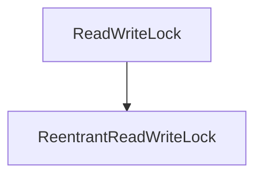

## JUC并发编程

### 1、JUC简介

**JUC:Java.util.concurrent,是java原生api下的一个包,里面放着跟多线程操作先关的一些类和接口,以及一些常用的并发工具类** 

### 2、进程与线程

进程：是计算机中的一个应用程序，例如QQ.exe 等

线程：进程中执行的具体的任务。java程序中至少存在两个线程，一个为main，另一个为GC

### 3、线程的六个状态

```java
public enum State {
    // java能够创建线程吗？ 不能！
 	// 新建
    NEW,
    // 运行
    RUNNABLE,

    // 阻塞
    BLOCKED,

    // 等待
    WAITING,

    // 延时等待
    TIMED_WAITING,

    // 终止！
    TERMINATED;
}
```

**注：java是无法创建线程的，因为他没有本地权限，他实际上调用的是本地的一个native方法，来完成对线程的创建**

### 4、sleep与wait的区别

- 不同之处

	1、sleep在线程休眠时，怀抱着锁，不释放锁，wait在等待时会释放锁

	- ​	在JUC编程中，实际休眠时使用的代码为

		```java
		TimeUnit.SECONDS.sleep(1111);
		```

	2、sleep是属于Thread类的方法，而wait是Object的方法

	3、使用的范围不同，wait和notifyall是一组，在线程通信时被使用，而sleep可以单独使用在任何地方，它是静态方法

- 相同之处

	1、他们都是使线程进入等待状态

	2、他们都是抛出 InterruptedException（中断） 异常

### 5、Lock锁

**Lock为JUC包下的接口，可以实现更好的加锁方式和对锁的自由控制**

传统的给并发代码加锁的方式为 synchronized ，或 synchronized 块

**样例：卖票**

#### synchronized 加锁

```java
// 传统的 Synchronized  Synchronized 方法 和 Synchronized 块
/*
 * 我们的学习是基于企业级的开发进行的；
 * 1、架构：高内聚，低耦合
 * 2、套路：线程操作资源类，资源类是单独的
 */
public class Demo01 {
    public static void main(String[] args) throws InterruptedException {
        // 1、新建资源类
        Ticket ticket = new Ticket();

        // 2、线程操纵资源类
        new Thread(new Runnable() {
            public void run() {
                for (int i = 1; i <=40; i++) {
                    ticket.saleTicket();
                }
            }
        },"A").start();


        new Thread(new Runnable() {
            public void run() {
                for (int i = 1; i <=40; i++) {
                    ticket.saleTicket();
                }
            }
        },"B").start();

        new Thread(new Runnable() {
            public void run() {
                for (int i = 1; i <=40; i++) {
                    ticket.saleTicket();
                }
            }
        },"C").start();
    }
}

// 单独的资源类，属性和方法！
// 这样才能实现复用！
class Ticket{

    private int number = 30;

    // 同步锁，比着厕所来记 =>close=>
    public synchronized void saleTicket(){
        if (number>0){
            System.out.println(Thread.currentThread().getName() + "卖出第"+(number--)+"票，还剩:"+number);
        }
    }
}
```

#### JUC后，Lock方式

```java
public static void main(String[] args) {
    Ticket ticket = new Ticket();

    new Thread(()->{
        for (int i = 0; i < 40; i++) {
            ticket.sale();
        }
    },"A").start();


    new Thread(()->{
        for (int i = 0; i < 40; i++) {
            ticket.sale();
        }
    },"B").start();
}

/**
     * 买票的类
     */
class Ticket2 {
    private Integer number = 50;
    /**
         * ReentrantLock 是一个可重入锁（开启大门后，到厕所，卧室，厨房，餐厅等，即不用再开）
         * 它默认是一个非公平锁（可以插队）
         * 公平锁：排队
         */
    Lock lock = new ReentrantLock();

    public void sale() {
        // 加锁
        lock.lock();
        try {
            // 业务
            if (number > 0) {
                System.out.println(Thread.currentThread().getName() + "卖出了票" + (number--) + "，还剩余：" + number + "张票");
            }
        } catch (Exception e) {
            e.printStackTrace();
        } finally {
            lock.unlock(); // 解锁
        }
    }
}
```

#### Lock和Synchronized的区别

1、Synchronized 是java的一个关键字，Lock是JUC下的一个接口

2、Synchronized 锁住的资源，需要等到完全释放锁后，下个线程才能访问 (傻傻的等),Lock可以尝试获取锁，失败以后可以放弃

3、Synchronized 无法尝试获取锁，Lock可以尝试获取并判断

4、Synchronized 会自动释放锁(a线程执行完毕后,b线程异常也会释放锁)，Lock锁必须手动进行释放，不释放就会变成死锁

5、Synchronized 一定是非公平的，而Lock可以是公平的，可以自己设置参数

6、Synchronized 适合锁少量同步代码，Lock适合锁大量同步代码

### 6、生产者消费者问题

三部曲：判断，执行，通知

叙述：判断锁的状态，执行业务代码，多锁之间的通讯

**样例：**

​		线程和线程之间本来是不能通信的，但有时我们需要线程之间进行协调操作。 比如有两个线程：A、B ，还有一个值初始为0，实现两个线程交替执行，对该变量 + 1，-1；交替10次。 先来看使用synchronized实现线程之间通信的版本，代码如下：

#### Synchronized版

```java
/**
 * 生产者与消费者   队列一样
 * @author Machenike
 */
public class Pc {
    // synchronized 版
    public static void main(String[] args) {
        Demo demo = new Demo();
        // 创建线程并执行
        new Thread(()->{for (int i = 0; i < 10; i++) demo.increment();},"A").start();
        new Thread(()->{for (int i = 0; i < 10; i++) demo.decrement();},"B").start();
    }
}

// 资源类独立，解耦
class Demo{
    private Integer number = 0;

    // 生产者
    public synchronized void increment() {

        if(number!=0) {
            // 等待
            try {
                this.wait();
            } catch (InterruptedException e) {
                e.printStackTrace();
            }
        }
        // +1 生产
        number ++;
        System.out.println(number);
        // 线程告知，通知，通信 告知其他线程
        this.notifyAll();
    }

    // 消费者
    public synchronized void decrement() {
        if(number==0) {
            // 等待
            try {
                this.wait();
            } catch (InterruptedException e) {
                e.printStackTrace();
            }
        }
        // +1 消费
        number --;
        // 执行业务
        System.out.println(number);
        // 线程告知，通知，通信 告知其他线程
        this.notifyAll();
    }
}
```

问题引出：四条线程，两条生产，两条消费，还可以正常执行么？答案是否定的，API详解为：


解决后为：将原本的if判断改为while即可

```java
while(number==0) {
    // 等待
    try {
        this.wait();
    } catch (InterruptedException e) {
        e.printStackTrace();
    }
}
```

**if和while的区别，当两个线程同时执行if判断，if只会判断一次，而while会对每一个线程都进行判断。**

下一个问题的引出：传统的wait和notify组合不能完成对线程的精准判断，此时我们考虑使用JUC来实现


#### JUC   Condition接口说明


**总结：使用Lock + Condition等于替换了原本基于Synchronized和wait的组合**

将原来的==wait()==方法和==notifyall()==方法替换为**Condition**的==await()==方法和==signalAll()==方法

具体不代码不再演示，直接看精准控制版本代码

#### Lock + Condition 实现精准控制唤醒

执行顺序为：A ---> B ---> C

```java
private Lock lock = new ReentrantLock();
	
private Condition condition1 = lock.newCondition();
private Condition condition2 = lock.newCondition();
private Condition condition3 = lock.newCondition();

// 每一个Condition对象单独监听独立的一个锁，以达到精准控制的目的

public void increment() {
    lock.lock();
    try { 
        while(number!=1) {
            // 等待
            condition1.await();
        }
        System.out.println(Thread.currentThread().getName()+ "  " +number);
        number = 2;
        // 精准控制唤醒线程
        condition2.signal();
    } catch (Exception e) {
        e.printStackTrace();
    }finally {
        lock.unlock();
    }
}
```

### 7、8锁现象

更好的理解锁？当前被锁住的对象是谁？判断当前的是什么锁？

#### 第一组

```java
import java.util.concurrent.TimeUnit;

/**
 * @author kate
 * @Date 2020/7/1 15:38
 * 1、同步方法，同一对象，线程执行处休眠，谁先执行 ？ send  or  call
 *    答案：A线程 先执行 ，1秒后执行 B线程
 *    原因：同一个对象，又使用了同步方法，只能同时有一个方法被执行，谁先拿到锁，先执行谁。
 *          毫无疑问，A线程比较靠前的拿到了锁
 *
 * 2、同步方法，同一对象，线程执行处休眠，资源方法内休眠，谁先执行？
 *    答案：A线程 先执行 ，3秒后执行 B线程
 *    原因：理论同上，唯一不同的是，即使拿到锁的方法进行了休眠，那么因为synchronized的原因，
 *          也要等它自己执行完毕后才会继续来后执行
 *
 */
public class T1 {
    public static void main(String[] args) {
        Phone1 phone1 = new Phone1();
        new Thread(()->{phone1.send();},"A").start();

        try {
            // JUC 版休眠
            TimeUnit.SECONDS.sleep(1);
        } catch (InterruptedException e) {
            e.printStackTrace();
        }

        new Thread(()->{phone1.call();},"B").start();
    }
}

class Phone1{
    /**
     * 发短信
     */
    public synchronized void send(){
        try {
            // JUC 版休眠
            TimeUnit.SECONDS.sleep(3);
        } catch (InterruptedException e) {
            e.printStackTrace();
        }
        System.out.println("发短信");
    }

    /**
     * 打电话
     */
    public synchronized void call(){
        System.out.println("打电话");
    }
}
```


#### 第二组：

```java
import java.util.concurrent.TimeUnit;

/**
 * @author kate
 * @Date 2020/7/1 15:38
 *
 * 3、对象不同，同步的方法，资源类的休眠，谁先执行？
 *    答案：程序启动一秒后，B线程执行完毕之后，3秒后 A线程执行
 *    原因：不同的对象锁就不同，当锁不同时，同步方法即无用，第一个方法进去后，因为等待，所以第二个线程先执行
 *
 * 4、对象相同，一个同步方法，一个不同步方法，谁先执行？
 *    答案：同上
 *    原因：同一个对象使用的是同一把锁，但有一个方法没有使用同步方法， 因此锁对他无用，
 *    第一个方法进去后，因为等待，所以无同步锁的第二个线程先执行
 */
public class T2 {
    public static void main(String[] args) {
        Phone2 phone2 = new Phone2();
        // 不同的对象
        // Phone2 phone21 = new Phone2();
        new Thread(()->{phone2.send();},"A").start();

        try {
            // JUC 版休眠
            TimeUnit.SECONDS.sleep(1);
        } catch (InterruptedException e) {
            e.printStackTrace();
        }

        new Thread(()->{phone2.call();},"B").start();
    }
}

class Phone2{
    /**
     * 发短信
     */
    public synchronized void send(){
        try {
            // JUC 版休眠
            TimeUnit.SECONDS.sleep(3);
        } catch (InterruptedException e) {
            e.printStackTrace();
        }
        System.out.println("发短信");
    }

    /**
     * 打电话
     */
    public void call(){
        System.out.println("打电话");
    }
}
```


#### 第三组：

```java
import java.util.concurrent.TimeUnit;

/**
 * @author kate
 * @Date 2020/7/1 15:38
 *
 * 5、同一个对象，同步的方法，加上static后，谁先执行？
 *    答案：A线程先执行，B线程后执行
 *    原因：
 *         1、Synchronized 同步的方法，同一个对象，同一个锁，谁先拿到锁谁先执行，等他执行完毕后，继续向下执行
 *         2、Class 锁，又叫模板锁，它跟对象不同，每一个对象都可以new一个新的对象，但Class全局唯一
 *            因为static在类编译时被编译，所以此时对Class进行了上锁，则同一个Class对象，又是同步的方法，因此
 *            A线程先执行，B紧随其后执行
 *            
 * 6、不同的对象，同步的方法，加上static后，谁先执行？
 *    答案：跟上述相反
 *    原因：参考上文 主要知识：掌握  Class锁
 */
public class T3 {
    public static void main(String[] args) {
        Phone3 phone3 = new Phone3();
        Phone3 phone31 = new Phone3();
        new Thread(()->{phone3.send();},"A").start();

        try {
            // JUC 版休眠
            TimeUnit.SECONDS.sleep(1);
        } catch (InterruptedException e) {
            e.printStackTrace();
        }

        new Thread(()->{phone31.call();},"B").start();
    }
}

class Phone3{
    /**
     * 发短信
     */
    public static synchronized void send(){
        try {
            // JUC 版休眠
            TimeUnit.SECONDS.sleep(3);
        } catch (InterruptedException e) {
            e.printStackTrace();
        }
        System.out.println("发短信");
    }

    /**
     * 打电话
     */
    public static synchronized void call(){
        System.out.println("打电话");
    }
}
```


#### 第四组：

```java
import java.util.concurrent.TimeUnit;

/**
 * @author kate
 * @Date 2020/7/1 15:38
 *
 * 7、两个对象，一个静态同步方法，一个普通同步方法，谁先执行？
 *    答案：B 优先于 A 执行
 *    原因：同下处一样，唯一需要注意是加了static的那个方法，锁的是Class，而不是不同的对象
 * 8、一个对象，一个静态同步方法，一个普通同步方法，谁先执行？
 *    答案：同上
 *    原因：锁的不同，static方法锁的是Class对象，一个普通同步方法锁的是当前操作它的对象，因此，当锁不同时
 *          Synchronized 变无用了，进入A线程执行资源时因睡眠，才首先执行B线程
 */
public class T4 {
    public static void main(String[] args) {
        Phone4 phone4 = new Phone4();
        Phone4 phone41 = new Phone4();
        new Thread(()->{phone4.send();},"A").start();

        try {
            // JUC 版休眠
            TimeUnit.SECONDS.sleep(1);
        } catch (InterruptedException e) {
            e.printStackTrace();
        }

        new Thread(()->{phone41.call();},"B").start();
    }
}

class Phone4{
    /**
     * 发短信
     */
    public static synchronized void send(){
        try {
            // JUC 版休眠
            TimeUnit.SECONDS.sleep(3);
        } catch (InterruptedException e) {
            e.printStackTrace();
        }
        System.out.println("发短信");
    }

    /**
     * 打电话
     */
    public synchronized void call(){
        System.out.println("打电话");
    }
}
```

### 8、集合安全类

#### List

原本我们操作的ArrayList是线程不安全的类，我们有以下几种方式使他们变得线程安全

##### 1、Vector 

```java
// 结果为：58左右，效率蛮快的
public static void main(String[] args) {
    long start = System.currentTimeMillis();
    List<String> list = new Vector<>();

    for (int i = 0; i < 10 ; i++) {
        new Thread(()->{
            list.add(UUID.randomUUID().toString().substring(0,6));
            System.out.println(list);
        }).start();
    }

    long end = System.currentTimeMillis();
    System.out.println(end - start);
}
```

##### 2、Collections.synchronizedList

```java
// 结果 55 - 60 之间
public static void main(String[] args) {
    long start = System.currentTimeMillis();
    List<String> list = Collections.synchronizedList(new LinkedList<>());

    for (int i = 0; i < 10 ; i++) {
        new Thread(()->{
            list.add(UUID.randomUUID().toString().substring(0,6));
            System.out.println(list);
        }).start();
    }

    long end = System.currentTimeMillis();
    System.out.println(end - start);
}
```

##### 3、CopyOnWriteArrayList

```java
// 结果  55 - 60 之间
public static void main(String[] args) {
    long start = System.currentTimeMillis();
    List<String> list = new CopyOnWriteArrayList<>();

    for (int i = 0; i < 10 ; i++) {
        new Thread(()->{
            list.add(UUID.randomUUID().toString().substring(0,6));
            System.out.println(list);
        }).start();
    }

    long end = System.currentTimeMillis();
    System.out.println(end - start);
}
// Juc方式代表写入时复制，它实现了读操作无锁，写操作则通过操作底层数组的新副本来实现，是一种读写分离的并发策略。原理： 它会拷贝原数组，修改后替换原来的数组，通过这种防御性的方式，实现另类的线程安全。
// 适用场合 多读，少写
```

#### Set

##### 1、Collections.synchronizedSet

```java
Set<String> set = Collections.synchronizedSet(new HashSet<>());

for (int i = 0; i < 10 ; i++) {
    new Thread(()->{
        set.add(UUID.randomUUID().toString().substring(0,6));
        System.out.println(set);
    }).start();
}
```

##### 2、CopyOnWriteArraySet

```java
Set<String> set = new CopyOnWriteArraySet<>();

for (int i = 0; i < 10 ; i++) {
    new Thread(()->{
        set.add(UUID.randomUUID().toString().substring(0,6));
        System.out.println(set);
    }).start();
}
```

#### Map

##### 1、Collections.synchronizedHashMap

```java
Map<String,Integer> map = Collections.synchronizedMap(new HashMap<>());

for (int i = 0; i < 10 ; i++) {
    int i1 = i;
    new Thread(()->{
        map.put(UUID.randomUUID().toString().substring(0,6),i1);
        System.out.println(map);
    }).start();
}
```

##### 2、ConcurrentHashMap

```java
Map<String,Integer> map = new ConcurrentHashMap<>();

for (int i = 0; i < 10 ; i++) {
    int i1 = i;
    new Thread(()->{
        map.put(UUID.randomUUID().toString().substring(0,6),i1);
        System.out.println(map);
    }).start();
}

```

**并发读写会产生非受检  并发写入异常：ConcurrentModificationException**

非受检异常 OOM 内存溢出：Out Of Memory

**集合可以使用JDK8提供的基于lamand表达式和提供的forEach方法**

例：List

```java
List<String> list = new CopyOnWriteArrayList<>();
list.forEach(l->System.out.println(l));
// l 代表每一项
```

例：Map

```java
Map<String,Integer> map = new HashMap<>();
map.forEach((k,v)-> System.out.println(k + v));
// k 代表每一个key  v 代表每一个 value
```

### 9、JUC 类例

#### 1、Callable

为什么会出现Callable类？它有什么作用？它真能代替Runnable么？

Callable接口类似于Runnable接口，它的功能同样是实现一个线程实例，**但不同于Runnable的是，它可以有返回值，且可以抛出异常他还具有缓存和阻塞的功能**

因为Callable实现了对Runnable的增强，替代这回事也分场合吧，但线程本身还是只接受Runnable的，所以无法完全替代

Callable调用样例：

```java
public class T5 {
    public static void main(String[] args) {

        FutureTask<String> stringFutureTask = new FutureTask<>(new MyThread());

        new Thread(stringFutureTask,"A").start(); // 即使两个线程执行，它也只会执行一次，因为缓存
        new Thread(stringFutureTask,"B").start();

        try {
            System.out.println(stringFutureTask.get()); // 获得返回值
        } catch (InterruptedException e) {
            e.printStackTrace();
        } catch (ExecutionException e) {
            e.printStackTrace();
        }
    }
}

class MyThread implements Callable<String> {

    @Override
    public String call() throws Exception {
        System.out.println("call()");
        TimeUnit.SECONDS.sleep(1);
        return "xxx";
    }
}
```

#### 2、辅助类

##### 1、CountDownLatch

减法计数器

```java
public static void main(String[] args) throws Exception {
    CountDownLatch countDownLatch = new CountDownLatch(6); // 给定指定计数范围

    for (int i = 0; i < 6; i++) {
        new Thread(()->{
            System.out.println(Thread.currentThread().getName()+" GO out");
            countDownLatch.countDown();  // -1
        },String.valueOf(i)).start();
    }

    // 等待线程计数为0
    countDownLatch.await();

    // 执行顺序不敢保证，但这句话一定是最后线程都执行完之后才打印
    System.out.println("关门");
}
```

##### 2、CyclicBarrier

加法计数器

```java
public static void main(String[] args) throws Exception {
    CyclicBarrier cyclicBarrier = new CyclicBarrier(7,()->{
        System.out.println("集齐龙珠，召唤神龙");  // 指定线程数 ，当线程执行到这个数量时，由最后一个线程
        // 来执行这个线程的逻辑
    });

    for (int i = 1; i <= 7; i++) {
        final int temp = i;
        new Thread(()->{
            System.out.println(Thread.currentThread().getName() + "     拿到第" + temp + "个龙珠");
            try {
                cyclicBarrier.await(); // 等待线程执行完毕
            } catch (InterruptedException e) {
                e.printStackTrace();
            } catch (BrokenBarrierException e) {
                e.printStackTrace();
            }
        },String.valueOf(i)).start();
    }

}
```

##### 3、Semaphore

**限流**
一次性只能有指定个线程进入运行，其余的等待

```java
public static void main(String[] args) throws Exception {
    Semaphore semaphore = new Semaphore(3,true); // 创建指定个数量的，公平的线程

    for (int i = 0; i < 6; i++) {
        final int temp = i;
        new Thread(()->{
            try {
                semaphore.acquire(); // 获得
            } catch (InterruptedException e) {
                e.printStackTrace();
            }
            System.out.println(Thread.currentThread().getName() + "     获得了第"+(temp+1)+"车位，其余人先等待！！！");
            try {
                TimeUnit.SECONDS.sleep(2);
            } catch (InterruptedException e) {
                e.printStackTrace();
            }
            // 释放该资源
            semaphore.release();
        },String.valueOf(i)).start();
    }
}
```

### 10、读写锁



使用读写锁

```java
public class Rw {

    public static void main(String[] args) throws Exception {
        // 5 个线程写
        MyCache myCache = new MyCache();
        for (int i = 0; i < 5; i++) {
            final int temp = i;
            new Thread(()->{
                // 调用写方法
                myCache.write(temp+"",temp);
            },String.valueOf(i)).start();
        }

        TimeUnit.SECONDS.sleep(3);
        // 5 个线程读
        for (int i = 0; i < 5; i++) {
            final int temp = i;
            new Thread(()->{
                // 调用写方法
                myCache.read(temp+"");
            },String.valueOf(i)).start();
        }
    }
}

class MyCache{
    volatile Map<String,Integer> map = new HashMap<>(); // volatile保证原子性

    // 加锁 创建时可创建公平锁
    private ReadWriteLock readWriteLock = new ReentrantReadWriteLock(boolean b);
    // 写
    public void write(String key,Integer v){
        readWriteLock.writeLock().lock();
        try {
            System.out.println(Thread.currentThread().getName() + "  开始写入");
            map.put(key,v);
            System.out.println(Thread.currentThread().getName () + "---> 写入OK");
        } catch (Exception e) {
            e.printStackTrace();
        }finally {
            readWriteLock.writeLock().unlock();
        }
    }


    // 读
    public void read(String key){
        readWriteLock.readLock().lock();
        try {
            System.out.println(Thread.currentThread().getName() + "  开始读取");
            System.out.println(Thread.currentThread().getName() + "  读取OK ,结果为：" + map.get(key));
        } catch (Exception e) {
            e.printStackTrace();
        }finally {
            readWriteLock.readLock().unlock();
        }
    }
}
```

### 11、阻塞式队列

阻塞：

-   队列空了，阻塞等待生产

-   队列满了，阻塞等待取出

    不得不阻塞


什么情况下我们会使用 阻塞队列：多线程并发处理，线程池  ！

#### **四组API**

| 操作     | 抛出异常 | 有返回值 | 超时等待  | 阻塞等待 |
| -------- | -------- | -------- | --------- | -------- |
| 添加     | add      | offer    | offer(,,) | put      |
| 移除     | remove   | poll     | poll(,)   | take     |
| 检索首部 | element  | peek     |           |          |

##### 1、抛出异常

```java
public static void t1() throws InterruptedException {
    // 声明队列长度初始值大小(必须)
    BlockingQueue<String> blockingQueue = new ArrayBlockingQueue<>(3);
    // 存数据 成功返回true，失败抛出异常 java.lang.IllegalStateException: Queue full
    System.out.println(blockingQueue.add("a"));
    System.out.println(blockingQueue.add("b"));
    System.out.println(blockingQueue.add("c"));

    System.out.println("===================");

    // 取出数据  先进先出原则(FIFO) 多取抛出异常  java.util.NoSuchElementException
    System.out.println(blockingQueue.remove());
    System.out.println(blockingQueue.remove());
    System.out.println(blockingQueue.remove());
}
```

##### 2、有返回值，无异常

```java
public static void t2() {
    // 声明队列长度初始值大小(必须)
    BlockingQueue<String> blockingQueue = new ArrayBlockingQueue<>(3);
    // 存数据 ,成功返回true 失败返回false
    System.out.println(blockingQueue.offer("a"));
    System.out.println(blockingQueue.offer("b"));
    System.out.println(blockingQueue.offer("c"));

    System.out.println("--------------------------");
    // 取数据 ，成功返回此数据，失败返回null
    System.out.println(blockingQueue.poll());
    System.out.println(blockingQueue.poll());
    System.out.println(blockingQueue.poll());
}
```

##### 3、阻塞等待

```java
public static void t3() throws InterruptedException {
    // 声明队列长度初始值大小(必须)
    BlockingQueue<String> blockingQueue = new ArrayBlockingQueue<>(3);
    // 存数据，成功无返回值，不成功的时候，程序阻塞到那里，一直等
    blockingQueue.put("a");
    blockingQueue.put("ac");
    blockingQueue.put("d");

    // 取 ,成功后返回此数据，失败了，程序阻塞，一直等
    System.out.println(blockingQueue.take());
    System.out.println(blockingQueue.take());
    System.out.println(blockingQueue.take());
}
```

##### 4、超时等待

它是offer和poll组合的方法重载，相当于它们的增强，增加了超时时间功能！

```java
public static void t4() throws InterruptedException {
    // 声明队列长度初始值大小(必须)
    BlockingQueue<String> blockingQueue = new ArrayBlockingQueue<>(3);
    // 存数据 ,成功返回true 失败后等待指定时间，指定时间结束后 返回false 程序继续往下执行
    System.out.println(blockingQueue.offer("a",2, TimeUnit.SECONDS));
    System.out.println(blockingQueue.offer("b",2, TimeUnit.SECONDS));
    System.out.println(blockingQueue.offer("c",2, TimeUnit.SECONDS));

    System.out.println("--------------------------");
    // 取数据 ，成功返回此数据，失败后等待指定时间，指定时间结束后 取出null 程序继续往下执行
    System.out.println(blockingQueue.poll(2,TimeUnit.SECONDS));
    System.out.println(blockingQueue.poll(2,TimeUnit.SECONDS));
    System.out.println(blockingQueue.poll(2,TimeUnit.SECONDS));
    System.out.println(blockingQueue.poll(2,TimeUnit.SECONDS));
}
```

